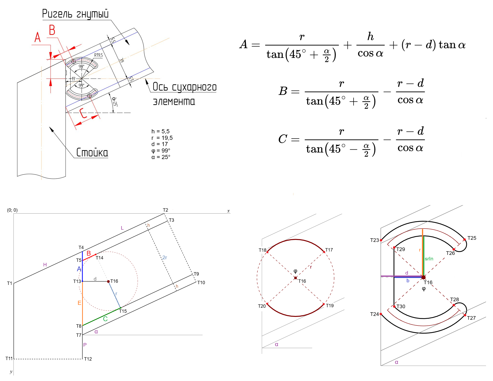

## Назначение

Определение позиции крепежа для наклонного Т-соединения стойки с ригелем светопрозрачных конструкций системы Alutech F50. Сухарный элемент из профиля F50.0415.

## URL

https://chernyshovn.github.io/sukharik/

## Конфигурация

  

